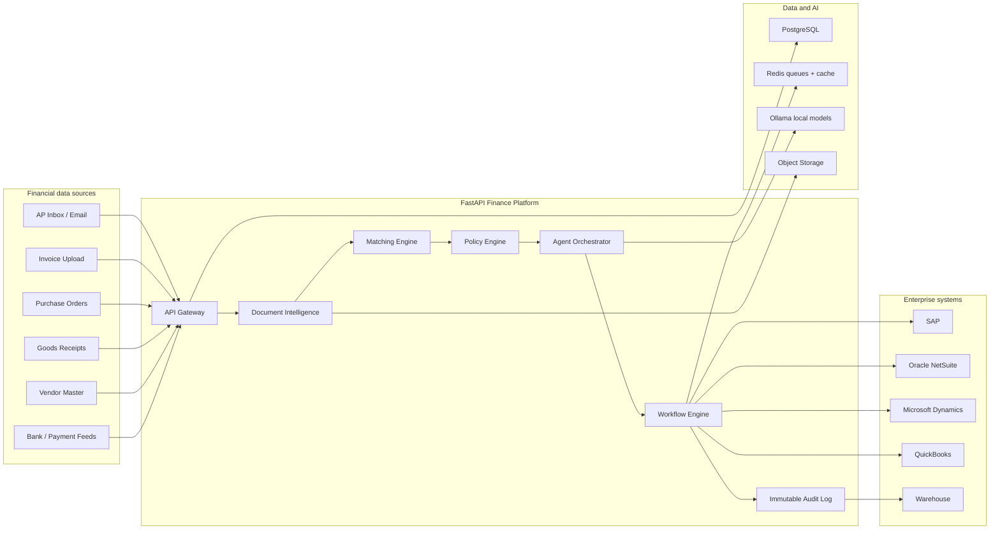
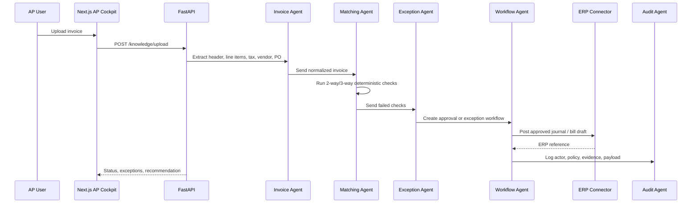
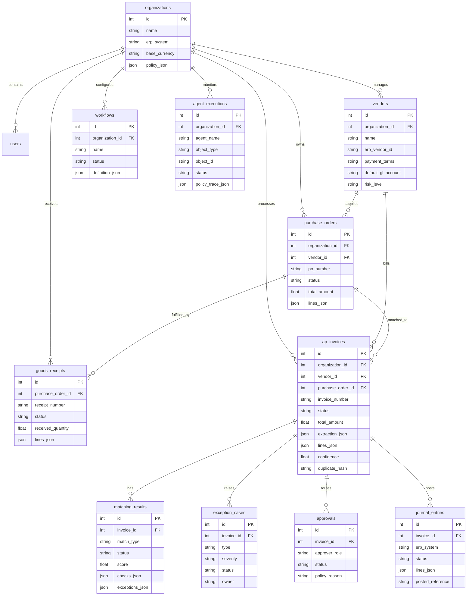

# FirstAI AP Automation Platform

This document redesigns Local-Agent into a Ledgent.AI-aligned autonomous Accounts Payable platform. It is written as if the product were being shaped by a founding engineering team building enterprise finance automation.

## Research Anchors

Ledgent.AI positions itself as an autonomous finance execution platform where agents understand, reason, and execute finance operations across enterprise systems. Public product pages emphasize invoice/PO/receipt/vendor master data, document intelligence, AI agents, policy engines, matching engines, ERP execution, RBAC, immutable audit logs, encryption, and segregation of duties.

The practical AP product implications are:

- The platform must not be only chat. It must be a transaction execution system.
- AI must be policy-constrained, explainable, and auditable.
- Matching must be deterministic first, AI-assisted second.
- ERP posting must be gated by controls, not free-form agent output.
- Exceptions are a first-class workflow, not an error state.
- Finance users need operational visibility: cycle time, match rate, exception backlog, liabilities, approvals, ERP sync health.

## Target Product

FirstAI AP becomes an AI-powered AP operations cockpit:

- Invoice ingestion from upload, email, portal, API, EDI, and scan queues
- OCR and document intelligence for headers, line items, tax, terms, vendor, PO references
- Vendor matching against vendor master data
- 2-way match: invoice against PO
- 3-way match: invoice against PO and goods receipt note
- Duplicate detection using vendor, invoice number, amount, date, and document hash
- Exception detection for price variance, quantity variance, missing PO, receipt gaps, tax mismatch, vendor bank risk, duplicate invoice
- Approval routing based on amount, entity, department, policy, and segregation of duties
- Journal entry draft generation and GL coding
- ERP sync into SAP, Oracle NetSuite, Microsoft Dynamics, QuickBooks
- Immutable audit trail for every AI and human action
- Agent monitoring and finance analytics

## Production Architecture



## Agent Architecture



### Specialized Agents

- Finance Agent: orchestrates policy and end-to-end finance decision flow.
- Invoice Agent: extracts invoice fields, line items, tax, remittance, due dates, GL hints.
- Matching Agent: performs 2-way and 3-way matching with tolerance policy.
- Exception Agent: classifies exceptions and recommends resolution paths.
- Reconciliation Agent: matches AP subledger, accruals, payments, vendor statements.
- ERP Integration Agent: prepares ERP payloads and handles sync failures.
- Audit Agent: records action lineage, policy trace, source evidence, rationale.
- Reporting Agent: explains trends, exposure, automation rate, close readiness.
- Workflow Agent: routes approvals and enforces segregation of duties.

## Frontend Architecture

```text
frontend/src/
  app/
    page.tsx                 AP command center
    layout.tsx               metadata and app shell
    icon.tsx                 dynamic AP icon
  components/
    ap/
      ap-command-center.tsx  AP cockpit, matching, agents, ERP sync
    chat/                    retained local finance agent chat
    ui/                      design primitives
  lib/
    api.ts                   typed API client
    types.ts                 AP and agent contracts
  store/
    app-store.ts             settings, chat, document upload state
```

UI direction:

- Stripe-like dense operational tables
- Linear-like compact workflow state
- Ramp/Brex-like finance clarity around money, risk, approvals
- Mercury-like clean typography and calm color
- Rippling-like modular admin surfaces

## Backend Architecture

```text
backend/
  api/
    routes.py                API gateway for AP, agent, settings, documents
  agents/
    manager.py               local agent orchestration
    planner.py               task planning
    executor.py              deterministic tool routing
    memory.py                long-term memory
  services/
    ap_platform.py           AP domain service and matching simulation
    knowledge.py             invoice/document text extraction
    ollama.py                local model gateway
    preferences.py           model/tool settings
  database/
    models.py                AP and agent execution schema
    session.py               SQLAlchemy session
  tools/
    code_tool.py
    file_tool.py
    search_tool.py
```

Near-term production upgrades:

- Move SQLite to PostgreSQL.
- Add Alembic migrations.
- Add Redis for job orchestration, idempotency, rate limiting, and model/OCR queues.
- Add S3-compatible object storage for invoice originals and OCR artifacts.
- Add background workers for OCR, matching, ERP sync, and retry flows.

## Database ERD



## API Specification

| Method | Path | Purpose |
| --- | --- | --- |
| GET | `/api/health` | Backend health and mode |
| GET | `/api/ap/overview` | AP metrics, invoices, exceptions, journals, agents |
| GET | `/api/ap/invoices` | Invoice work queue |
| GET | `/api/ap/agents` | Specialized finance agents |
| POST | `/api/ap/matching/run` | Deterministic 2-way/3-way matching simulation |
| GET | `/api/ap/architecture` | Runtime architecture snapshot |
| POST | `/api/knowledge/upload` | Invoice/document upload and extraction storage |
| POST | `/api/agent/stream` | Streaming local finance-agent workflow |
| GET | `/api/settings` | Local model, tools, and agent settings |

### Matching Request

```json
{
  "invoice_number": "AP-DEMO-NEW",
  "vendor_id": "ven-1017",
  "po_number": "PO-88022",
  "amount": 41720
}
```

### Matching Response

```json
{
  "status": "exception",
  "score": 55,
  "match_type": "3-way",
  "checks": [
    { "name": "Vendor matches PO", "status": "passed" },
    { "name": "Amount within tolerance", "status": "failed", "delta": 970 }
  ],
  "exceptions": [
    { "type": "price_variance", "severity": "high", "message": "Invoice variance is 970.00 against PO total." }
  ],
  "recommendation": "Route to exception workflow"
}
```

## Security Architecture

- Tenant isolation by organization ID on every domain object.
- RBAC roles: AP Clerk, AP Manager, Controller, Procurement Owner, Auditor, ERP Admin.
- Segregation of duties: AI can draft/recommend; high-risk posting requires distinct human approval.
- Immutable audit log for AI, human, and integration actions.
- Encryption in transit via HTTPS; at rest via managed PostgreSQL/storage encryption.
- Object storage private by default; signed URLs for short-lived access.
- Secrets in Railway/Vercel environment variables.
- ERP connector credentials isolated per organization and encrypted.
- Idempotency keys on invoice ingestion, posting, and ERP sync.
- PII and bank detail masking in logs and UI.
- SOC 2 roadmap: access controls, change management, incident response, vendor risk, logging evidence.

## Testing Strategy

- Unit tests for matching rules, tolerance policy, duplicate detection, GL coding helpers.
- API tests for validation, tenant scoping, idempotency, CORS, rate limits.
- Golden-file tests for invoice extraction from known PDFs/DOCX/text.
- Contract tests for SAP, NetSuite, Dynamics, QuickBooks connector payloads.
- Worker tests for retries, dead-letter queues, and partial ERP failures.
- Browser tests for AP dashboard, upload, exception routing, approval workflow.
- Security tests for RBAC, org isolation, audit immutability, secret redaction.
- Load tests for invoice ingestion bursts and month-end close activity.

## CI/CD Strategy

- GitHub Actions:
  - frontend typecheck and build
  - backend compile, unit tests, API contract tests
  - dependency audit
  - Docker image build
  - migration dry-run
- Vercel:
  - preview deployments for frontend PRs
  - production alias after main passes
- Railway:
  - backend deploy from `backend` root using `railway up . --path-as-root`
  - health checks at `/api/health`
  - release rollback on failed health
- Database:
  - Alembic migrations reviewed in PR
  - migration backup before production apply

## Scalability Plan

1. Replace local SQLite with Railway PostgreSQL.
2. Add Redis-backed job queues for OCR, matching, approvals, ERP sync, and reporting.
3. Split API and workers into separate Railway services.
4. Store invoice originals in S3-compatible object storage.
5. Add per-tenant partitioning strategy for invoices, audit logs, and agent executions.
6. Add vector retrieval for vendor policy, chart of accounts, and historical invoice examples.
7. Add connector workers per ERP with independent retry/dead-letter queues.
8. Add observability: structured logs, traces, metrics, dashboard alarms.
9. Add read replicas/warehouse sync for analytics at scale.

## Ledgent Alignment Matrix

| Ledgent direction | Current implementation | Gap |
| --- | --- | --- |
| Autonomous finance agents | Nine finance agents modeled in UI/API | Need persistent agent execution queue |
| AP invoice processing | Invoice queue, upload, extraction storage | Need production OCR/classifier |
| PO/receipt matching | Deterministic matching API | Need line-level matching and learning from corrections |
| Exception handling | Exception center and routing recommendations | Need workflow state machine and SLA tracking |
| ERP posting | ERP sync surface and journal preview | Need real SAP/NetSuite/Dynamics/QuickBooks connectors |
| Auditability | Audit schema and backend security headers | Need immutable append-only log with hash chaining |
| Policy engine | Tolerances and SoD policy represented | Need tenant-configurable policy DSL |
| Enterprise security | RBAC/security architecture documented | Need auth provider and org-scoped enforcement |
| Production infra | Vercel/Railway live, FastAPI/Next.js | Need PostgreSQL, Redis, Docker, CI, tests |

## Missing Skills To Demonstrate

- ERP connector development: SAP BAPI/OData, NetSuite REST/SuiteTalk, Dynamics Dataverse, QuickBooks API.
- Accounting domain depth: accruals, GL coding, taxes, landed cost, multi-entity, intercompany.
- Document AI: OCR quality handling, table extraction, confidence calibration, human correction loops.
- Workflow systems: idempotent jobs, retries, dead-letter queues, approval SLA escalation.
- Security/compliance: SOC 2 controls, RBAC, audit immutability, tenant isolation.
- Production data: PostgreSQL migrations, Redis queues, observability, load testing.

## Engineering Roadmap

### Phase 1: Portfolio Pivot

- AP command center UI
- AP domain API endpoints
- Matching simulation
- Finance agent list
- Architecture docs and schema
- Live Vercel/Railway deploy

### Phase 2: Data Foundation

- PostgreSQL on Railway
- Alembic migrations
- Organization/vendor/invoice/PO/GRN CRUD
- Invoice object storage
- Audit event writer

### Phase 3: Invoice Intelligence

- OCR worker
- Header and line-item extraction
- Confidence scoring
- Duplicate detection
- Vendor/entity resolution
- Human correction UI

### Phase 4: Matching and Exceptions

- 2-way and 3-way line-level matching
- Tolerance policies
- Exception workflow state machine
- Approval routing
- SLA and escalation

### Phase 5: ERP Execution

- NetSuite connector first
- QuickBooks connector second
- SAP/Dynamics adapter interfaces
- Journal/bill draft posting
- Sync retries and reconciliation

### Phase 6: Enterprise Readiness

- Auth/RBAC
- Tenant isolation tests
- Immutable audit log
- Observability dashboards
- CI/CD quality gates
- SOC 2 readiness artifacts

## Sprint Plan

### Sprint 1

- Build AP command center.
- Add AP overview/matching APIs.
- Add AP domain database schema.
- Deploy live.

### Sprint 2

- Add PostgreSQL and Alembic.
- Build vendor, PO, GRN, invoice CRUD APIs.
- Add seed data and API tests.

### Sprint 3

- Build invoice upload workflow with OCR job states.
- Add extraction review UI.
- Add duplicate detection.

### Sprint 4

- Implement line-level 2-way/3-way matching.
- Add exception center workflow transitions.
- Add approval policy engine.

### Sprint 5

- Add journal entry generation.
- Add QuickBooks/NetSuite sandbox connector.
- Add ERP sync retry/dead-letter flow.

### Sprint 6

- Add auth/RBAC, audit immutability, org isolation tests.
- Add observability and deployment hardening.

## Deployment Checklist

- Frontend production URL configured in backend CORS.
- `NEXT_PUBLIC_API_BASE_URL` points to Railway `/api`.
- Railway deploy uses `backend` as root.
- Health check path is `/api/health`.
- Upload size and type limits enforced.
- Security headers visible on backend responses.
- Agent stream endpoint works in production.
- AP overview endpoint works in production.
- Matching endpoint returns deterministic checks.
- Dynamic icon route returns `image/png`.
- Mobile viewport has no horizontal overflow.
