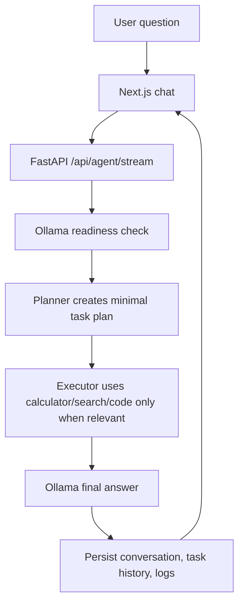

# FirstAI Product Architecture

FirstAI is a real local-agent product, not a scripted demo. The current production scope is intentionally narrow:

- One clean chat surface
- One FastAPI backend
- One Ollama model service
- Real persisted conversations, tasks, logs, settings, and uploaded knowledge
- No mock AP dashboards, hardcoded invoice data, fake vendor risks, or static model responses

## Runtime Flow

## Production Services

- Vercel hosts the Next.js frontend.
- Railway hosts the FastAPI backend.
- Railway hosts Ollama as a private service.
- The backend requires Ollama in production before accepting agent requests.

## Product Rules

- Do not invent data.
- Do not return canned demo responses.
- Do not silently fall back to fake answers when the model is unavailable.
- Ask for missing source data when analysis depends on unavailable documents or records.
- Keep the UI minimal, light, readable, and stable on mobile.
- Prefer deterministic tools for deterministic work such as arithmetic.

## Backend Modules

- `agents/manager.py`: orchestrates request, tools, model answer, persistence
- `agents/planner.py`: creates short operational plans without model dependency
- `agents/executor.py`: routes only relevant tasks to tools
- `tools/calculator.py`: deterministic math execution
- `tools/search_tool.py`: local knowledge and memory retrieval
- `tools/code_tool.py`: model-backed code generation
- `services/ollama.py`: Ollama health, readiness, generation
- `services/knowledge.py`: local document ingestion and search
- `services/memory_store.py`: local memory storage

## Testing Contract

Before release:

- Python compile check passes.
- Next.js production build passes.
- Local Ollama health returns a loaded model.
- Local agent answers a general factual question.
- Local agent refuses to invent missing source data.
- Local UI renders without overlap on desktop and mobile.
- Production backend health is ready.
- Production Ollama test returns `OK`.
- Production agent answers through Ollama.
- Production frontend renders the clean chat UI.
